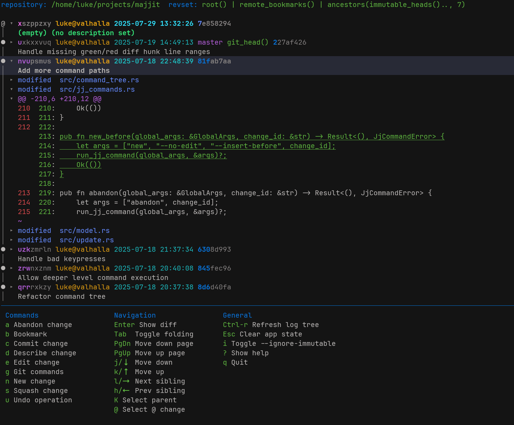

# majjit

A Rust [Jujutsu](https://github.com/jj-vcs/jj) TUI inspired by [Magit](https://magit.vc/)!

Very much a work in progress, much more to come. But I already use it personally.

To give majjit a try, just clone the repo and run `cargo run --release`.
